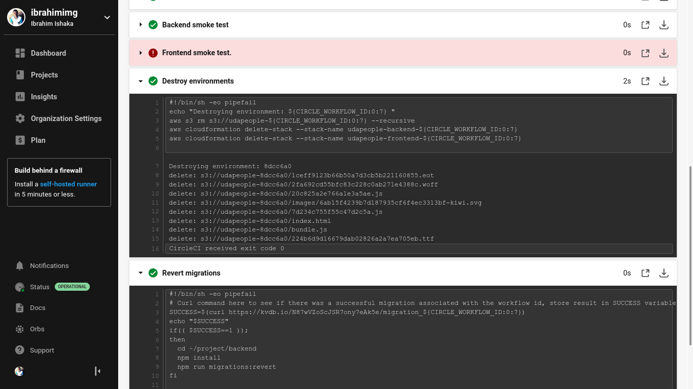
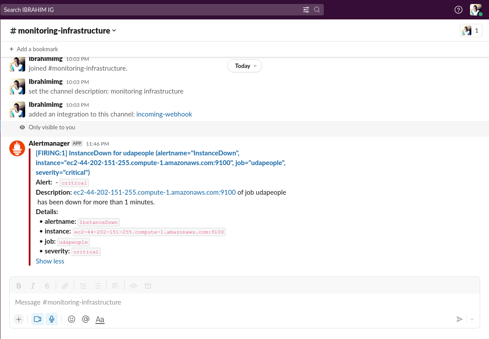

# Project Solution Screenshots

## Job failed because of compile errors

## Job failed because of unit tests

## Job that failed because of vulnerable packages

## An alert from one of your failed builds

## Appropriate job failure for infrastructure creation

## Appropriate job failure for the smoke test job

## Successful rollback after a failed smoke test

## Successful promotion job

## Successful cleanup job

## Only deploy on pushed to master branch

## Graph of EC2 instance including available memory, available disk space, and CPU usage.

## Alert sent by Prometheus

## Evidence of deployed and functioning front-end application in CloudFront (aka, your production front-end)

## Evidence of a healthy backend application

## Prometheus server showing UP state 

